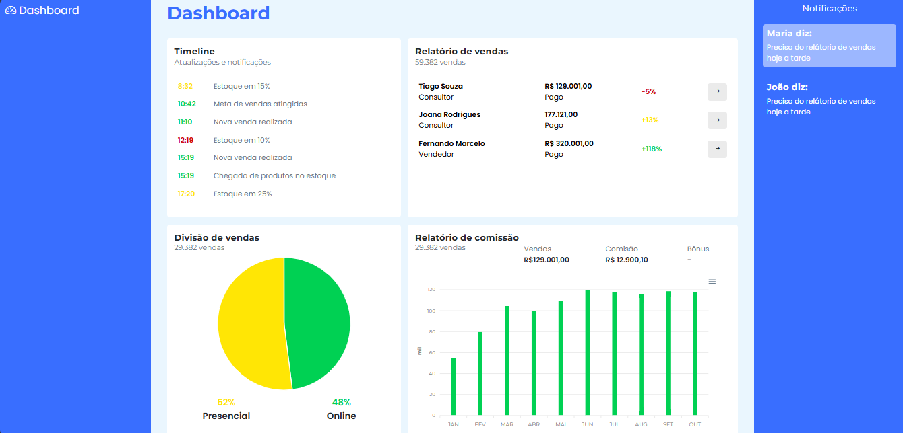

# Dashboard de Relatórios com ApexCharts

Este projeto é um painel de relatórios interativo com gráficos de **pizza** e **barra**, utilizando a biblioteca [ApexCharts](https://apexcharts.com/). O layout é estilizado com CSS personalizado para garantir uma aparência moderna e responsiva.

## 🧩 Tecnologias Utilizadas

- [ApexCharts.js](https://apexcharts.com/)
- HTML5
- CSS3 (customizado)
- JavaScript (puro)

## 📊 Funcionalidades

- **Gráfico de Pizza**: mostra a distribuição entre os modos de atendimento "Online" e "Presencial".
- **Gráfico de Barras**: exibe a evolução mensal de comissão ao longo do ano.
- **Responsividade**: layout adaptado para dispositivos móveis e desktops.
- **Estilização personalizada**: com fontes modernas como _Poppins_ e _Montserrat_ e esquema de cores adaptado para legibilidade e impacto visual.

## 📁 Estrutura dos Arquivos

```
project-root/
├── index.html
├── charts.js
├── custom.css
└── README.md
```

## 💡 Como Utilizar

1. **Clone o repositório**:
   ```bash
   git clone https://github.com/seu-usuario/seu-repositorio.git
   cd seu-repositorio
   ```

2. **Abra o arquivo `index.html` em seu navegador**:
   Você pode abrir diretamente com um duplo clique ou usar uma extensão como "Live Server" no VS Code.

3. **Personalize os dados**:
   Os dados dos gráficos estão nos arquivos JS (`charts.js`) e podem ser ajustados conforme suas necessidades.

## 🖼️ Preview



## 📌 Observações

- Os gráficos são renderizados com `ApexCharts`, portanto é necessário que a biblioteca esteja corretamente carregada no HTML via CDN ou arquivo local.
- As fontes utilizadas são do Google Fonts: `"Poppins"` e `"Montserrat"`.

## 📄 Licença

Este projeto está sob a licença [MIT](LICENSE).
